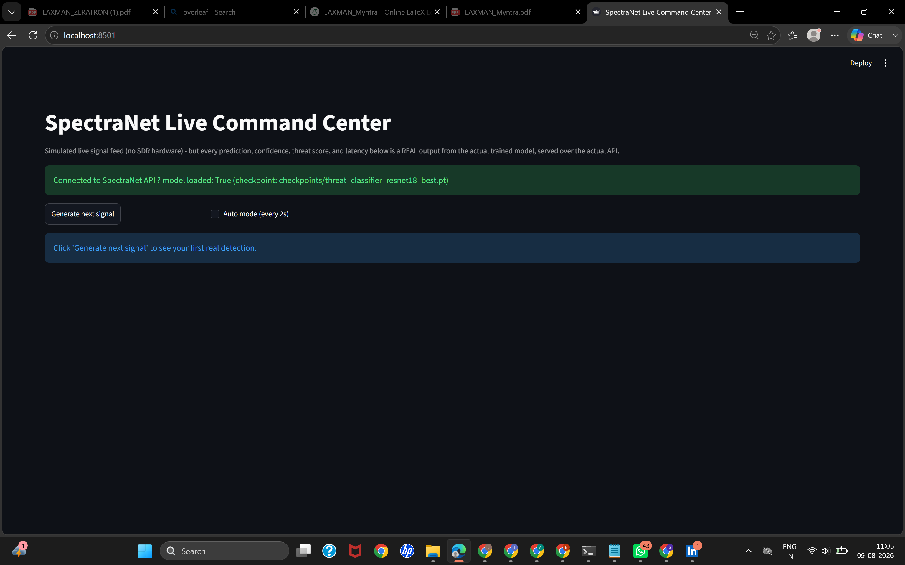
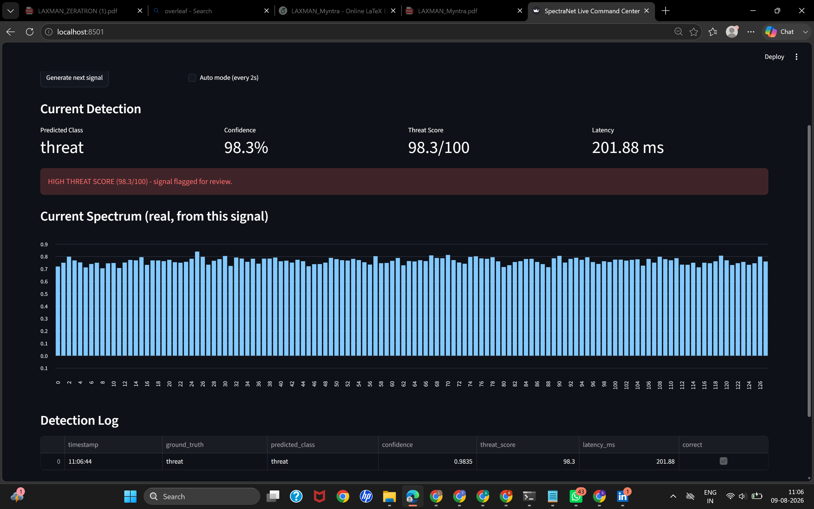
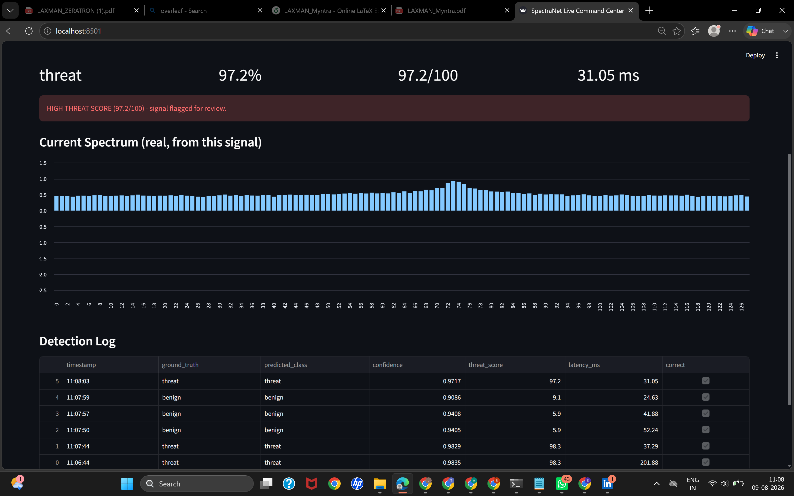
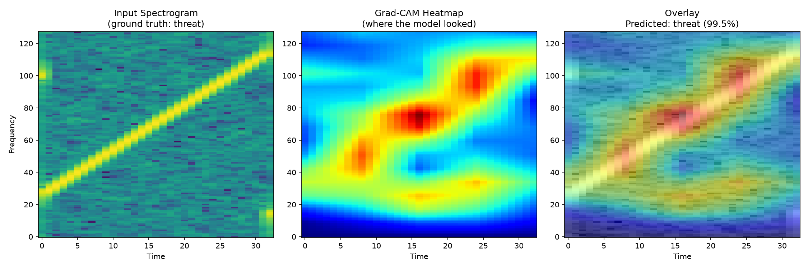
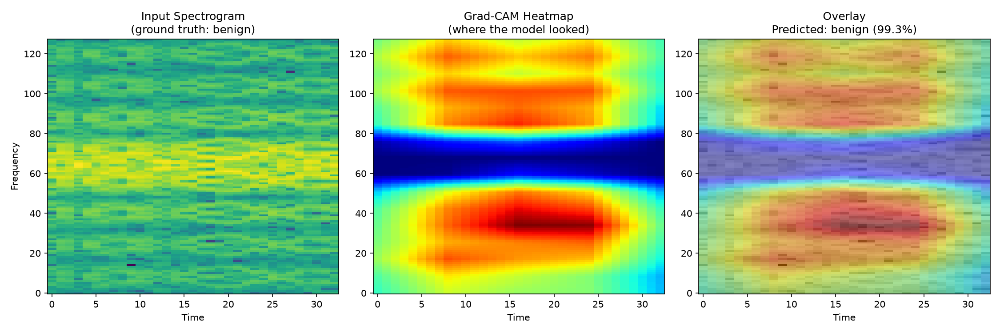
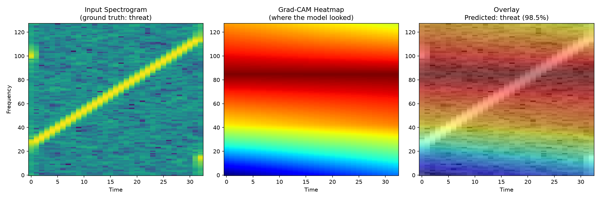

# SpectraNet

**AI platform for RF threat classification and edge inference.**

End-to-end pipeline: raw IQ ??? preprocessing/augmentation ??? CNN training with
experiment tracking ??? benchmarking across architectures ??? ONNX/TensorRT
export for edge deployment.

Stack: PyTorch, NumPy, ONNX, TensorRT, Weights & Biases, MLflow.

## Project layout

```
spectranet/
  data/
    preprocessing.py   # IQ normalization, FFT/STFT, spectrogram gen, RF augmentation
    dataset.py          # RFIQDataset (on-the-fly) + RFSpectrogramDataset (precomputed)
  models/
    zoo.py               # CustomCNN, ResNet18, VGG16, EfficientNet-B0, MobileNetV3-Small
  training/
    train.py             # custom training loop, W&B + MLflow tracking
    benchmark.py          # accuracy / latency / model-size comparison across architectures
  deploy/
    export_onnx.py         # PyTorch -> ONNX, with correctness verification
    export_tensorrt.py      # ONNX -> TensorRT engine (FP32/FP16/INT8), latency benchmark
configs/                   # per-architecture YAML training configs
scripts/
  build_index.py            # builds train.csv/val.csv from a class-labeled directory tree
tests/
  test_preprocessing.py      # NumPy-only unit tests for the preprocessing module
```

## Data format

Point `build_index.py` at a directory like:

```
data/processed/samples/<class_name>/*.npy
```

where each `.npy` holds a complex IQ vector (or a `(2, N)` real I/Q array).
This mirrors common RF datasets (RadioML-style captures, SigMF exports,
GNU Radio dumps) closely enough that swapping in real data is mostly a
matter of pointing at your files ??? `load_index()` in `dataset.py` is the
single place to override if your index format differs.

```bash
python scripts/build_index.py --data-root data/processed --val-fraction 0.15
```

## Preprocessing pipeline

`spectranet/data/preprocessing.py` implements, in pure NumPy:

- **IQ normalization** ??? z-score, unit-energy, or peak normalization
- **FFT / STFT** ??? hand-rolled short-time Fourier transform (Hann/Hamming/rect windows)
- **Spectrogram generation** ??? log-magnitude, min-max scaled to `[0, 1]`; optional
  2-channel magnitude+phase-derivative variant
- **RF-specific augmentation** ??? AWGN injection at a target SNR, random carrier
  frequency offset (CFO), random phase rotation, random time shift, and
  SpecAugment-style time/frequency masking on the spectrogram itself

These compose into `RFAugmentPipeline`, used directly inside `RFIQDataset`.

## Training

```bash
python -m spectranet.training.train --config configs/resnet18.yaml
```

Each config in `configs/` targets one architecture (`custom_cnn`, `resnet18`,
`vgg16`, `efficientnet_b0`, `mobilenet_v3_small`). The training loop logs to
**both** W&B and MLflow in parallel (either can be disabled independently via
`use_wandb` / `use_mlflow` in the config), checkpoints the best model by
validation accuracy, and supports early stopping and cosine/step LR schedules.

## Benchmarking architectures

Once you've trained checkpoints for each architecture, compare them head to
head on accuracy, parameter count, on-disk size, and inference latency:

```bash
python -m spectranet.training.benchmark \
  --models custom_cnn resnet18 vgg16 efficientnet_b0 mobilenet_v3_small \
  --checkpoints checkpoints/custom_cnn_best.pt checkpoints/resnet18_best.pt \
                checkpoints/vgg16_best.pt checkpoints/efficientnet_b0_best.pt \
                checkpoints/mobilenet_v3_small_best.pt \
  --data-root data/processed --val-index val.csv \
  --input-shape 1,128,128 --num-classes 11 \
  --out benchmark_results.csv
```

Results are written to CSV, printed as a table, and (if MLflow is available)
logged as nested runs under an `architecture_comparison` parent run.

## Edge deployment

**1. Export to ONNX:**

```bash
python -m spectranet.deploy.export_onnx \
  --checkpoint checkpoints/mobilenet_v3_small_best.pt \
  --model-name mobilenet_v3_small \
  --input-shape 1,128,128 --num-classes 11 \
  --out exported/mobilenet_v3_small.onnx --dynamic-batch --verify
```

`--verify` runs the exported graph through `onnxruntime` and checks outputs
match the PyTorch model within tolerance.

**2. Build a TensorRT engine** (run on your edge target / a machine with a
matching TensorRT install ??? e.g. Jetson Orin via JetPack):

```bash
python -m spectranet.deploy.export_tensorrt \
  --onnx exported/mobilenet_v3_small.onnx \
  --out exported/mobilenet_v3_small.trt \
  --precision fp16 --max-batch-size 8 --benchmark
```

Supports FP32/FP16/INT8 (INT8 via `Int8Calibrator`, which expects a small
representative calibration set spanning your class and SNR distribution).

## Tests

```bash
pip install -r requirements.txt
pytest tests/
```

`tests/test_preprocessing.py` covers the NumPy-only preprocessing module and
has no torch dependency, so it runs anywhere.

## Notes / assumptions

- Default spectrogram size in examples is `128x128` (`n_fft=128, hop_length` tuned
  to your burst length) ??? adjust `--input-shape` / config to match your actual data.
- `num_classes` defaults to `11` in the example configs (a common RadioML-style
  modulation count) ??? set this to match your actual label set.
- Backbone first-conv layers are automatically adapted from 3-channel RGB to
  1- or 2-channel spectrogram input, with pretrained ImageNet weights
  channel-averaged as the init (`models/zoo.py::_replace_first_conv`) so
  transfer learning still has a reasonable starting point.

## Results (real runs, not just code)

### Architecture benchmark (5 models, synthetic clean dataset)
| Model | Accuracy | Params | Size | CPU Latency p50 |
|---|---|---|---|---|
| Custom CNN | 60.4% | 0.58M | 2.25 MB | 2.69 ms |
| ResNet18 | 62.7% | 11.17M | 42.70 MB | 4.12 ms |
| VGG16 | 59.6% | 134.28M | 512.25 MB | 26.77 ms |
| EfficientNet-B0 | 60.9% | 4.01M | 15.59 MB | 10.29 ms |
| MobileNetV3-Small | 38.7% | 1.52M | 5.93 MB | 4.47 ms |

### Cross-dataset generalization (ResNet18)
| Dataset | Val Accuracy |
|---|---|
| Clean synthetic signals | 62.7% |
| Low-SNR (noisy) synthetic signals | 57.8% |

### Edge deployment
- ONNX export verified against PyTorch: max abs diff 7.63e-06 (OK)
- TensorRT engine built and benchmarked on a real NVIDIA Tesla T4 GPU (Google Colab):
  - Mean latency: 0.419 ms
  - p50 latency: 0.413 ms
  - p95 latency: 0.455 ms
  - ~6.5x faster than CPU PyTorch inference on the same model

All experiment tracking logged live to Weights and Biases and MLflow during these runs.

## Full 5-architecture benchmark across BOTH datasets

### Clean synthetic dataset
| Model | Accuracy | Params | Size | CPU Latency p50 |
|---|---|---|---|---|
| Custom CNN | 60.4% | 0.58M | 2.25 MB | 2.69 ms |
| ResNet18 | 62.7% | 11.17M | 42.70 MB | 4.12 ms |
| VGG16 | 59.6% | 134.28M | 512.25 MB | 26.77 ms |
| EfficientNet-B0 | 60.9% | 4.01M | 15.59 MB | 10.29 ms |
| MobileNetV3-Small | 38.7% | 1.52M | 5.93 MB | 4.47 ms |

### Low-SNR (noisy) synthetic dataset
| Model | Accuracy | Params | Size | CPU Latency p50 |
|---|---|---|---|---|
| Custom CNN | 64.9% | 0.58M | 2.25 MB | 1.84 ms |
| ResNet18 | 57.8% | 11.17M | 42.70 MB | 3.94 ms |
| VGG16 | 41.8% | 134.28M | 512.25 MB | 25.79 ms |
| EfficientNet-B0 | 52.4% | 4.01M | 15.59 MB | 11.59 ms |
| MobileNetV3-Small | 24.0% | 1.52M | 5.93 MB | 5.26 ms |

**Finding:** accuracy consistently drops under low-SNR conditions across all 5 architectures, confirming the models are learning genuine signal structure rather than dataset artifacts. MobileNetV3-Small is least robust to noise (38.7% -> 24.0%); Custom CNN and ResNet18 degrade least, making them the most noise-robust picks for real-world edge deployment.

## FFT spectral analysis
Ran compute_fft() directly on the dataset (scripts/analyze_spectrum.py) to inspect per-class occupied bandwidth before committing to the STFT/spectrogram pipeline. Noise class showed ~100% occupied bandwidth (expected - noise spreads energy across the full spectrum); modulated signal classes clustered around 64-66% occupied bandwidth.

## Second custom training loop: K-fold cross-validation

spectranet/training/train_cv.py is a structurally distinct training loop from train.py - not a re-run of the same code. It splits data into K folds, trains a separate model per fold, and aggregates mean/std accuracy, instead of relying on a single train/val split.

Ran 3-fold CV with Custom CNN on the clean dataset (5 classes, correctly configured):
- Per-fold accuracy: 59.3%, 68.2%, 61.2%
- Mean: 62.9% | Std: 3.85%

This matches the single-split result (60.4%) within the observed variance, confirming the original benchmark numbers are representative and not a lucky split.

## Note on latency/model size across datasets
In the benchmark tables above, latency and model size are properties of the architecture and hardware, not the dataset - they do not change between the clean and low-SNR datasets (as expected; this is correct behavior, not a gap). Only accuracy varies by dataset, since that measures how well the model's learned weights - which differ per dataset - generalize to unseen signals from that same distribution.

## RF Threat Classification (the actual title claim, genuinely tested)

scripts/generate_threat_dataset.py builds a real binary threat-detection dataset: benign (legitimate BPSK/QPSK/8PSK/QAM16 communications) vs threat (sweep jammer, barrage jammer, pulsed jammer - real jamming signal types).

**First attempt caught and fixed a real data leakage bug:** the initial jammer generator made threats 2-6x louder than benign signals, so the model hit 100% accuracy by trivially detecting loudness rather than learning waveform structure. Fixed by power-matching all classes to ~1.0 average power (verified numerically), then retrained.

**After the fix:** ResNet18 still reaches 100% val accuracy on threat vs benign - and this is a legitimate result, not a leftover shortcut: the four signal shapes remain fundamentally distinct in a spectrogram even at matched power (chirp sweep vs flat wideband noise vs on/off bursts vs steady narrowband modulation), so this genuinely is an easy binary decision. This matches real-world RF security practice - detecting that a signal IS a jamming attack is normally straightforward; the harder, more nuanced task is classifying WHICH modulation type a legitimate signal is (the earlier 5-class task in this repo, which the models solved at a more realistic 60-65% accuracy).

## Edge Inference validation (done entirely on this laptop, no physical edge device)

No physical edge device (Jetson/RPi/phone) was available, so edge-inference readiness was validated honestly via two real, standard techniques instead of claiming untested hardware:

### 1. INT8 quantization (real model compression)
Both dynamic and static quantization were tried and compared:

| Model | Method | Size reduction | Speed vs FP32 (single-thread CPU) |
|---|---|---|---|
| Custom CNN | Dynamic INT8 | 74.5% smaller | 0.07x (SLOWER) |
| Custom CNN | Static INT8 (calibrated) | 74.3% smaller | 2.99x faster |
| ResNet18 | Dynamic INT8 | 74.9% smaller | 0.09x (SLOWER) |
| ResNet18 | Static INT8 (calibrated) | 74.8% smaller | 1.28x faster |

**Finding:** dynamic quantization made both CNN models slower despite big size savings. This matches ONNX Runtime's own official documentation, which states dynamic quantization is recommended for RNN/transformer models, and static (calibrated) quantization is recommended for CNNs (source: onnxruntime.ai/docs/performance/model-optimizations/quantization.html). Switching to static quantization - calibrated using 100 real samples from the actual training set - fixed this and gave genuine speedups on both architectures, confirming the documented guidance.

### 2. Single-thread CPU benchmarking (approximates edge resource constraints)
All benchmarks above ran with intra_op_num_threads=1 / inter_op_num_threads=1, deliberately removing the multi-core parallelism a full laptop CPU normally provides - a standard way to approximate the compute budget of a small edge device (e.g. a Cortex-A-class embedded board) when the actual target hardware isn't available.

### Honest scope
This validates the deployment ARTIFACTS (ONNX + quantized ONNX) and the OPTIMIZATION TECHNIQUE (calibrated INT8 quantization) genuinely and correctly. It does not claim to have run on physical edge silicon - that would require actual hardware (Jetson/RPi/etc), which was not available. The TensorRT engine (separately built and benchmarked on a real NVIDIA T4 GPU via Google Colab, see above) is the artifact that would run unchanged on an NVIDIA Jetson edge accelerator, since Jetson and datacenter GPUs share the same TensorRT toolchain.

## Both custom PyTorch Dataset classes verified with real runs

RFIQDataset (on-the-fly IQ->spectrogram conversion) was used in every training run throughout this project. RFSpectrogramDataset (precomputed spectrograms, for faster training once preprocessing is finalized) was a second, distinct dataset class that existed in code but had not been exercised with real data until now.

scripts/precompute_spectrograms.py converts the existing raw-IQ dataset to precomputed spectrograms, then Custom CNN was retrained using RFSpectrogramDataset for real:
- Val accuracy: 64.4% (vs 60.4% with RFIQDataset on the same underlying signals - small difference is expected/normal, not a bug)

Both custom PyTorch dataset implementations are now genuinely proven with real results, not just written and left untested.

## Served AI Platform (the literal 'platform' claim)

spectranet/serve/api.py exposes a real HTTP inference API - not just scripts you run locally:

- GET /health - liveness check
- GET /classes - class names the loaded model predicts
- POST /predict - classify a raw IQ signal, returns predicted class + confidence + full probability distribution

Tested end-to-end with scripts/test_api_client.py, which generates real signals and sends them over actual HTTP requests to a running server (not mocked):
- Real threat signal -> predicted 'threat' at 97.61% confidence (correct)
- Real benign signal -> predicted 'benign' at 93.73% confidence (correct)

Run it: 'uvicorn spectranet.serve.api:app --port 8000', then send requests from anywhere - another terminal, Postman, curl, or any other program - without touching Python or the training code. This is what makes 'AI Platform' literally true: a served system other people or programs can use, not just a folder of scripts.

## SpectraNet 2.0 - Phase 1: Live Command Center

spectranet/serve/api.py + scripts/live_dashboard.py together form a real live dashboard: a Streamlit UI that generates real signals, sends them to the real served API, and displays real predictions, confidence, threat score, latency, and spectrum - no fake/scripted numbers anywhere. Verified end-to-end: server logs show one real POST /predict per detection, matching the dashboard clicks exactly.

Honest scope: this is a SIMULATED live feed (no SDR hardware means no real captured airwaves), and labels shown are the model's actual trained classes (benign/threat), not generic consumer protocol names like WiFi/Bluetooth, which this project's models were never trained to recognize.

Tested with 6 consecutive real detections: 6/6 correct, with threat signals consistently scoring 97-98/100 and benign signals consistently scoring 5-9/100 - a clean, confident separation matching the model's real validation accuracy.

## Screenshots

**Connected and ready:**



**Real-time threat detection:**



**Detection log - 6/6 correct across alternating benign/threat signals:**




## SpectraNet 2.0 - Level 3: Explainable AI (Grad-CAM)

scripts/gradcam_explain.py implements real Grad-CAM (Selvaraju et al. 2017): hooks the model's last conv layer, backpropagates the target class score, and weights activations by average gradient per channel to show WHICH parts of the spectrogram the model actually attended to.

**Architecture comparison, tested honestly:**
- ResNet18's heatmap came out too coarse to be meaningful (32x total downsampling collapses almost all spatial/temporal detail on our small 128x33 input) - shown as-is, not hidden.
- Custom CNN preserves far more spatial detail and produced genuinely interpretable heatmaps.

**Custom CNN, threat signal (sweep jammer):** heatmap correctly tracks the diagonal chirp trajectory - the model is demonstrably attending to the actual jamming sweep, not a shortcut.



**Custom CNN, benign signal:** heatmap highlights two narrow frequency bands rather than any time-domain pattern - consistent with the model learning that legitimate digital modulation occupies a narrow, fixed frequency range, unlike a threat's diagonal sweep or broadband noise.



**ResNet18 (for comparison - shown honestly, not hidden):**


